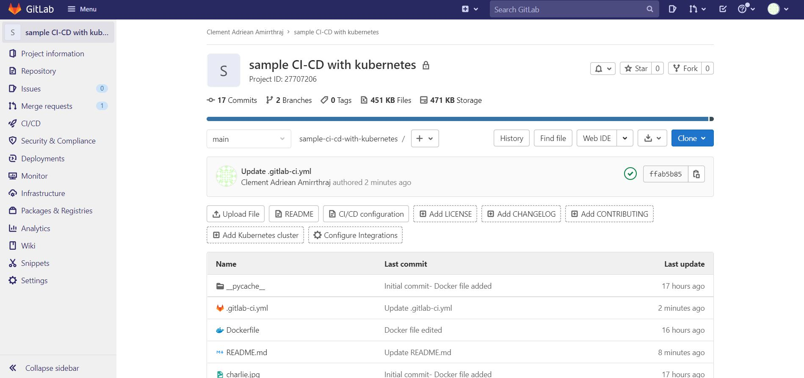
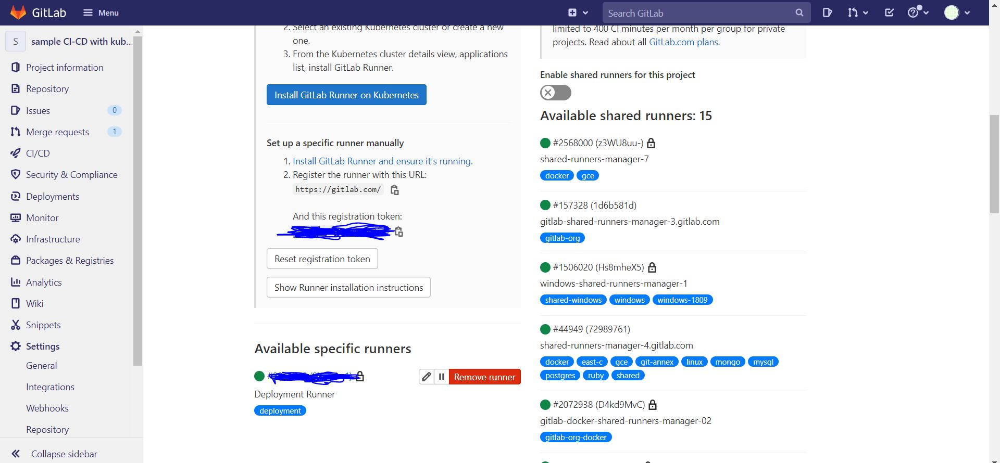
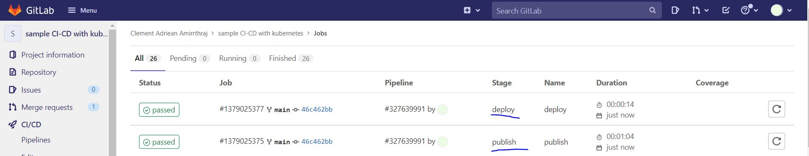
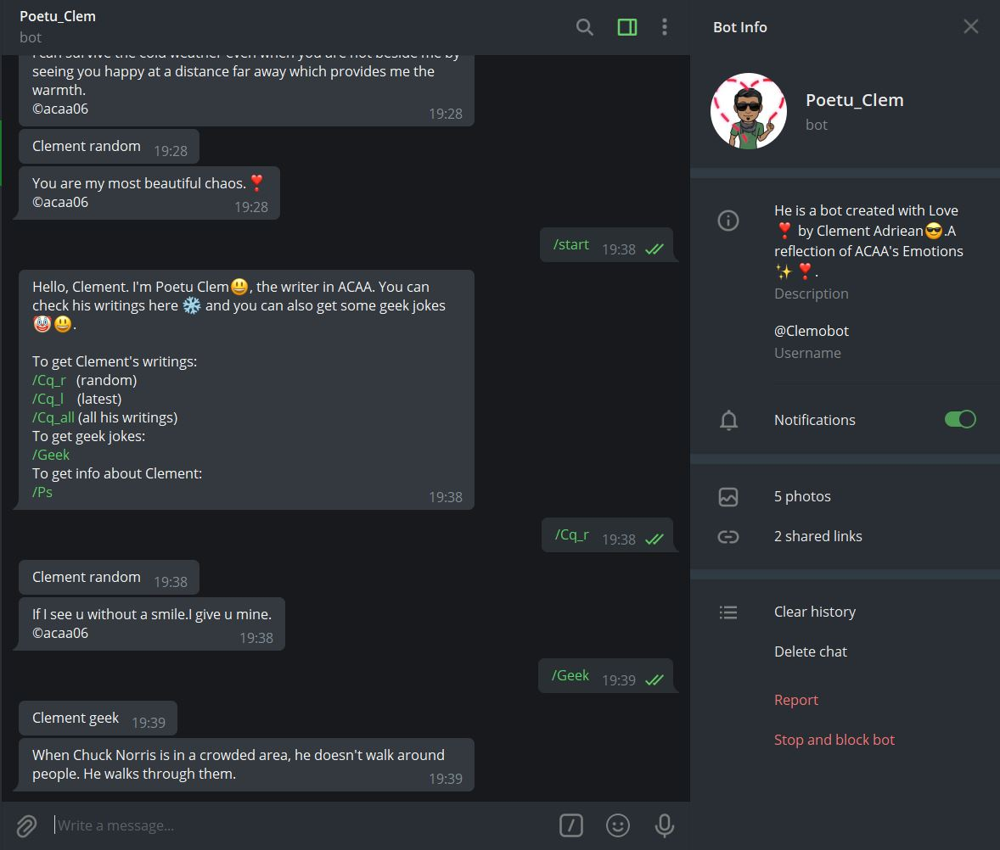

# GitLab CI-CD with kubernetes
This repository is a Proof of Concept of Learning Containerisation of the application and Continuous Integration / Continuous Deployment through Gitlab pipeline in Kubernetes.
This application is a Telegram bot. You can replace the token u get from the BotFather in the main.py file and run the server file to bring the bot live. I'm going to containerise the bot and going to deploy the image in the kubernetes..
## Prerequisites
1. GitLab Account
2. Gitlab Runners running in a server and registering your repo. (GitLab runners can be installed in kubernetes cluster too.)
3. Docker repository and Docker File
4. .gitlab-ci.yml file should be created
5. Kubernetes cluster in GCP or AWS (I have used GCP here)

### Gitlab Account
Create a free gitlab account and push your code to repo.


### Gitlab Runners
Go to settings>>CI_CD>>Runners
You can register a gitlab-runner in a server or install it in kubernetes.
OR
You can also use a shared runner but u have to provide your credit or debit card details.


### Docker File
```FROM python:3
WORKDIR /usr/src/app
COPY . .
RUN pip install requests
CMD ["python","server.py"]
```
Here I'm using the python 3 base image and copying all the files in the repo to the Working Directory, and installing the requests library. Finally I'm running the python server.py command to run the bot.

### Docker Registry
To push the image u need a Docker registry. U can create it for free in hub.docker.com .


### Kubernetes Deployment file
You have to write this file to deploy your image in k8.
```
apiVersion: apps/v1
kind: Deployment
metadata:
  name: telebot
  labels:
    app: telebot
spec:
  replicas: 1
  selector:
    matchLabels:
      app: telebot
  template:
    metadata:
      labels:
        app: telebot
    spec:
      containers:
        - name: poetu-bot
          image: clemadr/telegram-poetu-bot:latest
          imagePullPolicy: Always

```
### GITLAB-CI
```
stages:
  - publish
  - deploy

variables:
  TAG_LATEST: clemadr/telegram-poetu-bot:latest
  TAG_COMMIT: clemadr/telegram-poetu-bot:latest
  DOCKER_PASS: $Password
  DOCKER_USER: $Username

publish:
  image: docker:latest
  stage: publish
  services:
    - docker:18.09.7-dind
  script:
    - docker build -t $TAG_LATEST .
    - echo $DOCKER_PASS | docker login -u $DOCKER_USER --password-stdin 
    - docker push $TAG_COMMIT
deploy:
  stage: deploy
  image: claranet/gcloud-kubectl-docker:latest
  script:
    - echo "$SERVICE_ACCOUNT_KEY" > key.json
    - cat key.json
    - gcloud auth activate-service-account --key-file=key.json
    - gcloud config set project vb-test-304305
    - gcloud config set container/cluster cicd
    - gcloud config set compute/zone us-central1-a
    - gcloud container clusters get-credentials cicd --zone us-central1-a
    - kubectl apply -f kubectl-deployment.yaml

```
Here we are using two stages publish and deploy. This file is mandatory for the pipeline to execute.

### Service Account Key
You have to set your GCP SERVICE ACCOUNT KEY in settings>>CICD>>VARIABLES.

### OUTPUT
After each commit the job runs and it has been passed



# Telegram Bot

 